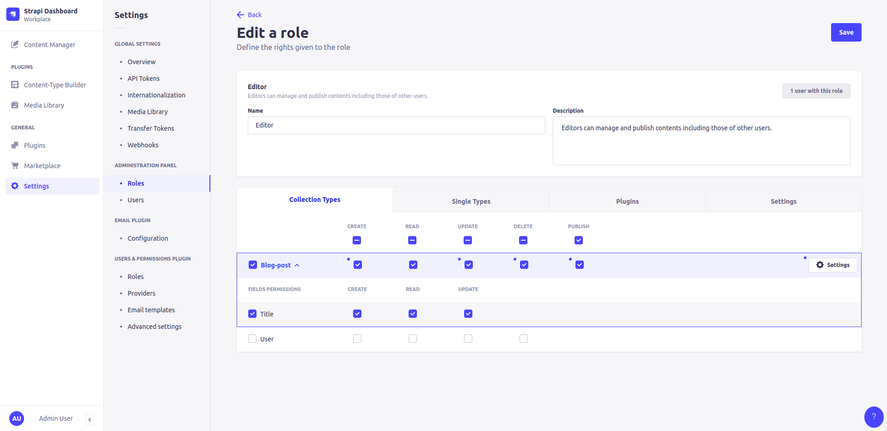
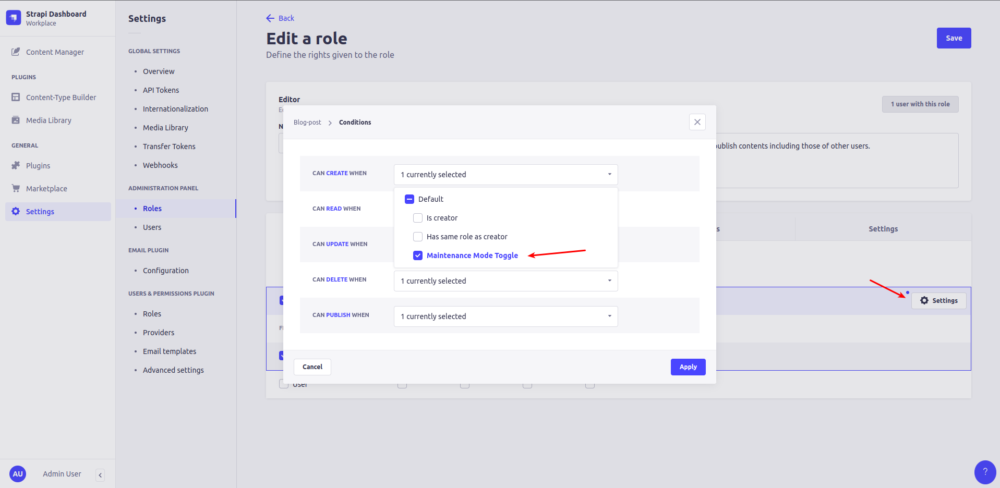
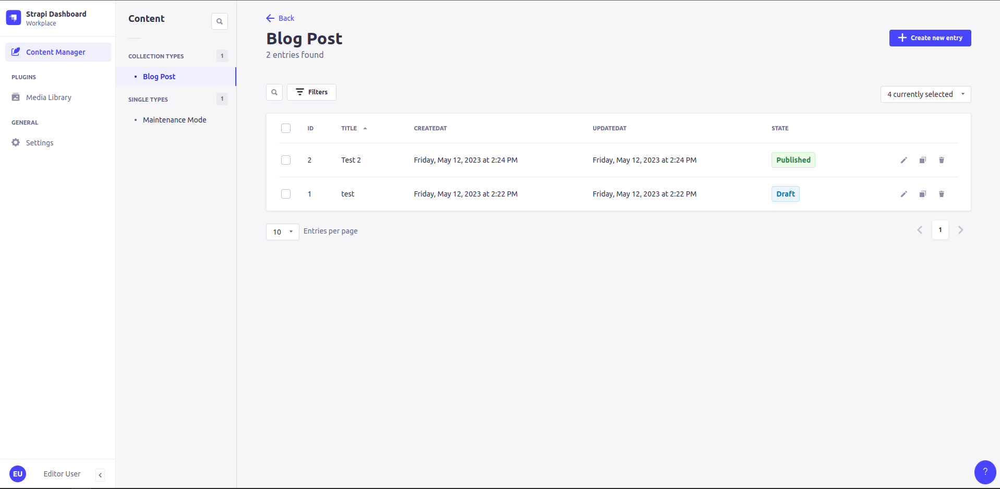
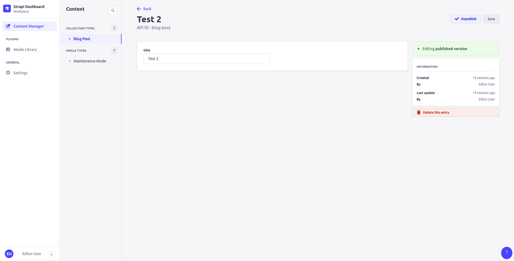
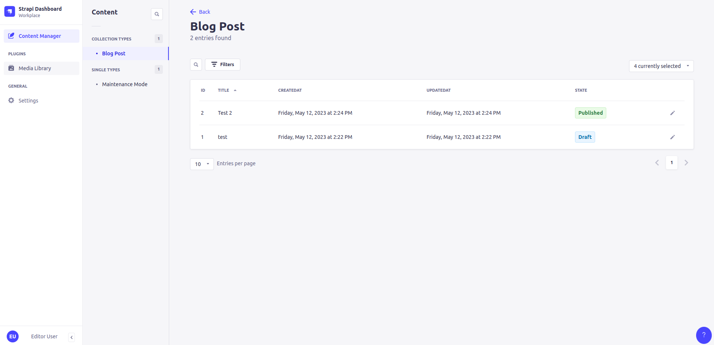
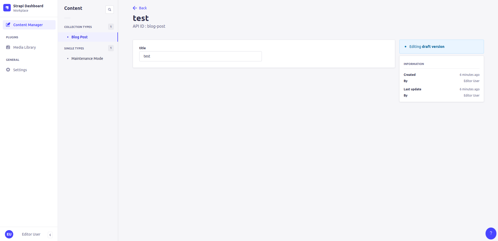
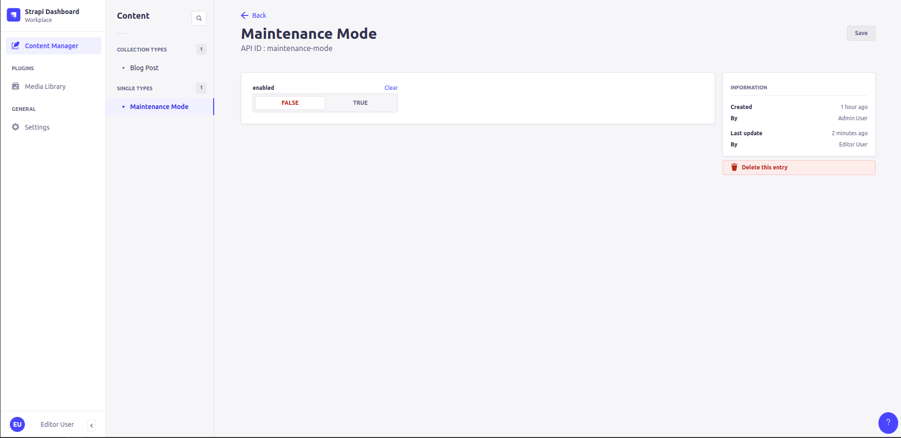

# Strapi example app - Maintanance Mode Lockdown

This is an example Strapi app that demonstrates how you can use a single-type to lock down creating, updating, deleting, or publishing content dynamically for certain roles and content-types via a dynamic RBAC conditional. For more information about the RBAC conditionals system please see [this documentation](https://docs.strapi.io/dev-docs/configurations/rbac#declaring-new-conditions).

## Example setup

Included in this sample repo is a `dataExport.tar.gz` file that can be used to seed this demo application using the [Strapi DTS import feature](https://docs.strapi.io/dev-docs/data-management/import). After running `yarn install` and copying over the `.env.example` to `.env` you can run `yarn strapi import --file dataExport.tar.gz` to import the data. You can then run `yarn develop` to start the application.

By default two users are created:

- `test@test.com` with the password `Test1234!` and has the role of `Super Admin`
- `test2@test.com` with the password `Test1234!` and has the role of `Editor`

## How the conditional is defined

Within the [./src/index.js](./src/index.js) file you will find the following code:

```js
module.exports = {
  // ...
  async bootstrap({ strapi }) {
    const maintenanceModeCondition = {
      displayName: "Maintenance Mode Toggle",
      name: "maintenance-mode-toggle",
      async handler(user) {
        let maintenanceMode = await strapi.entityService.findMany(
          "api::maintenance-mode.maintenance-mode"
        );
        if (maintenanceMode && maintenanceMode.enabled === true) {
          return false;
        }
        return true;
      },
    };
    await strapi.admin.services.permission.conditionProvider.register(
      maintenanceModeCondition
    );
  },
};
```

What this is doing is creating a new condition that fetches the `Maintenance Mode` single-type and checks to see if the `enabled` field is set to `true`. If it is then the condition returns `false` which means that the user will not be able to create, update, delete, or publish content. If the `enabled` field is set to `false` then the condition returns `true` which means that the user will be able to create, update, delete, or publish content.

This condition is then registered with the Strapi RBAC system so that it can be used to dynamically set the condition on specific content-types and roles.

## How the condition is used

Within the Strapi RBAC system (pictured below) you will see that there is a new condition called `Maintenance Mode Toggle` that can be used to dynamically set the permissions for a specific role and content-type.





When this condition is set it limited in it's scope to the content-type and role that it is set on. This means that you can have multiple content-types that have different permissions based on the `Maintenance Mode` single-type. All can be set, updated, or deleted while in a production setting and without restarting the Strapi application.

## How the view looks to a user

When the maintenance mode is disabled, their permissions remain intact and they can create, update, delete, and publish content as normal.





When the maintenance mode is enabled, their permissions are removed and they can no longer create, update, delete, or publish content.





## Maintenance Mode Single-Type

The single-type used for the maintenance mode is very simplistic and only has a single field called `enabled` that is a boolean. This is used to toggle the maintenance mode on and off.

Of course a custom plugin could be built with much more functionality and a more robust maintenance mode system. This is just a simple example to demonstrate the concept.



## Demo Video

This demo just quickly shows off the interface differences, note that I made a small mistake in the demo as to publish an entry you also need update permissions as well (since it's updating a field called `publishedAt`)

Demo Video: https://www.loom.com/share/7cc930f6a60f4d48b166ceb4adfe4256
